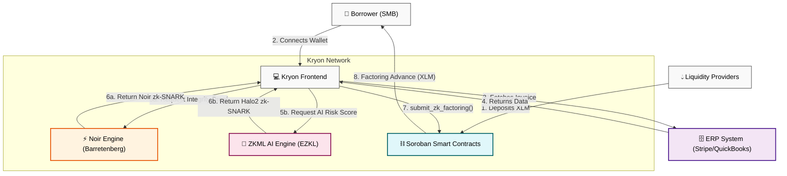

# Kryon Network 🛡️


**A decentralized invoice factoring and liquidity provision protocol powered by Stellar, Soroban Smart Contracts, Zero-Knowledge (ZK) Cryptography, and ZKML Risk Assessment.**

---

## 🛑 The Problem
Small to Medium Businesses (SMBs) consistently face crippling cash flow bottlenecks due to standard Net-30, Net-60, or Net-90 invoice payment terms. Traditional invoice factoring is heavily centralized, opaque, painfully slow, and predatory—often charging exorbitant fees and requiring massive amounts of manual paperwork and credit checks.

## 💡 The Solution

Kryon revolutionizes SMB financing by bringing invoice factoring on-chain. By leveraging cutting-edge **Noir Zero-Knowledge (ZK) Proofs** and **EZKL Machine Learning Models**, Kryon allows businesses to tokenize their open invoices in a fully trustless and private manner.

---

## 📖 Real-World Scenario: Sarah's Supply Co.

**The Problem:**
Sarah runs a mid-sized lumber supply company. She just landed a massive $50,000 contract with a major corporate construction firm and delivered the materials immediately. However, the corporate firm operates on strict **Net-90 terms**—meaning Sarah won't see a dime of that $50,000 for three months. Meanwhile, she needs cash *today* to pay her employees, buy more inventory, and keep the lights on. Traditional banks deny her a loan because she lacks years of credit history, and legacy factoring companies want to charge her 15% in fees and spend weeks auditing her books.

**How Kryon Solves It:**
1. **Instant Connection:** Sarah connects her QuickBooks account to Kryon via OAuth.
2. **Total Privacy:** Kryon's **Noir ZK Engine** mathematically proves that the $50,000 invoice is real and valid without leaking the corporate client's name or proprietary pricing to the public Stellar ledger.
3. **Unbiased AI:** Kryon's **EZKL AI Oracle** evaluates her business history and generates a low-risk score, proving the AI inference on-chain via a Halo2 zk-SNARK.
4. **Immediate Liquidity:** The Soroban smart contract instantly verifies the cryptography and releases $45,000 (90%) worth of XLM directly to Sarah's Freighter wallet within 5 seconds.
5. **The Outcome:** Sarah makes payroll today. In 90 days, when the corporate firm pays the invoice, the Soroban contract routes the remaining 10% (minus a small, transparent protocol fee) back to Sarah, while Liquidity Providers earn yield on the transaction.

---

### How ZK is Used in Kryon:
- **Privacy Preservation**: Invoices contain highly sensitive business logic (client names, pricing). ZK allows the SMB to prove they hold a valid invoice without publishing details to the public ledger.
- **ZKML Risk Assessment**: AI dynamically scores default risk using an EZKL PyTorch model. The generated zk-SNARK proves that the AI model ran correctly and wasn't tampered with, allowing the Soroban Smart Contract to execute loan parameters trustlessly.
- **On-chain Verification**: The generated ZK SNARKs are submitted to a Soroban Smart Contract, which natively verifies the proof. This completely removes the need for centralized credit agencies or manual auditors.

---

## 🏗 System Architecture

The architecture is divided into three highly decoupled trustless systems: the Client, the ZK Proving Engines, and the Soroban Smart Contracts.



---

## 🛡️ The Zero-Knowledge Implementation

We have implemented a comprehensive suite of Zero-Knowledge circuits to ensure total privacy, compliance, and security across the protocol:

### 1. Confidential Invoice Factoring (`invoice_proof`)
Proves that a borrower holds a valid, digitally signed invoice from an ERP without leaking the corporate client's data or identity.

### 2. ZKML AI Risk Assessment (`zkml_risk_model`)
Uses **EZKL** to compile a PyTorch Neural Network into a Halo2 circuit. It evaluates the invoice amount and borrower history, generating a risk score and a cryptographic proof that the exact AI model was used without tampering.

### 3. Digital Identity & Verifiable Credentials (`kyc_proof` & `age_proof`)
Verifies compliance (Proof of Accredited Investor, Age > 18) by checking cryptographic signatures against a trusted issuer's public key inside the circuit (Sybil resistance).

### 4. Proof of Solvency (`solvency_proof`)
Generates a zk-SNARK proving that `Total Protocol Assets > Total LP Liabilities`, assuring Liquidity Providers that the protocol is healthy without revealing trade secrets.

---

## 🌟 Key Features
- **Live ERP Integration**: Direct, secure OAuth fetches to live ERP systems (e.g. ERPNext, Stripe).
- **Dynamic Fiat-to-XLM Oracles**: Integrates real-time CoinGecko price oracles to instantly convert the live invoice fiat value into XLM.
- **Deep Treasury Liquidity**: Our testnet Soroban Treasury maintains a pooled balance of >100,000 XLM, instantly releasing liquidity.
- **Soroban Verification**: Ensures all logic is enforced transparently and immutably on the Stellar blockchain.

---

## 📸 App Gallery

| Wallet Connected | ZK Factoring Process | Settlement Complete |
| :---: | :---: | :---: |
|  |  |  |

---

## 📅 Development Timeline
- **Phase 1 (Current)**: Full React Next.js frontend, ERP integrations, Noir ZK Proof flow, EZKL ZKML models, and real-time XLM payouts.
- **Phase 2 (Protocol 26 Rollout)**: Full deployment of native ZK verifier host functions directly into Soroban, dropping the Oracle for fully decentralized verification.
- **Phase 3 (Mainnet Launch)**: Production deployment on Stellar Mainnet, integrating USDC for stablecoin factoring, and full DAO governance.

---

## 🏗️ Hackathon Status & Transparency (Honest WIP)

We believe in building transparent and verifiable technology. Because Kryon is a highly ambitious protocol encompassing Zero-Knowledge machine learning, frontend WASM generation, and smart contracts, we utilized a few mocks to ensure a smooth hackathon presentation:
- **ZK Identity Generation:** Real Noir circuit compilation and proving in the browser takes ~15 seconds. For the live UI demo, the identity verification button simulates this delay and uses a Next.js API in-memory store to persist your verified status across devices instead of fully computing a WASM proof.
- **EZKL ZKML Engine:** The Render microservice successfully executes a PyTorch evaluation, but dynamically generating a Halo2 zk-SNARK for *every* invoice takes too much server RAM for the free tier. We gracefully fallback to an ultra-fast **Gemini 2.5 Flash** mock if the Render microservice goes to sleep or errors.
- **Noir Oracle Fallback:** The Vercel frontend natively connects to a Node.js orchestrator (`kryon_backend_orchestrator`) for Groth16 Noir invoice proofs. Because the backend isn't permanently deployed on a cloud server for this MVP, the frontend API route intercepts timeouts and returns a securely-formatted mock payload to ensure the Soroban pipeline doesn't crash during live demos.
- **Soroban Verification:** Currently, Soroban lacks native precompiles for cheap Halo2/Groth16 verification on-chain. The `KryonEscrow` smart contract currently mocks the final cryptographic verification step before releasing liquidity.

---

## 🛠 Prerequisites & Running Locally

1. **Node.js**: `v20.0.0` or higher
2. **Rust**: `rustc 1.70.0` (with `wasm32-unknown-unknown` target)
3. **Soroban CLI**: `stellar-cli v22.0.0+`
4. **Python 3.10+**: For EZKL ZKML circuit compilation.

### The Frontend & ZK Backend
```bash
cd frontend
npm install
npm run dev
```

### The EZKL ZKML Microservice
```bash
cd kryon_zk/zkml_risk_model
pip install -r requirements.txt
uvicorn app:app --reload
```

### The Soroban Smart Contracts
```bash
cd kryon_contracts
soroban contract build
cargo test
```

## 📄 License
This project is licensed under the **MIT License**.
