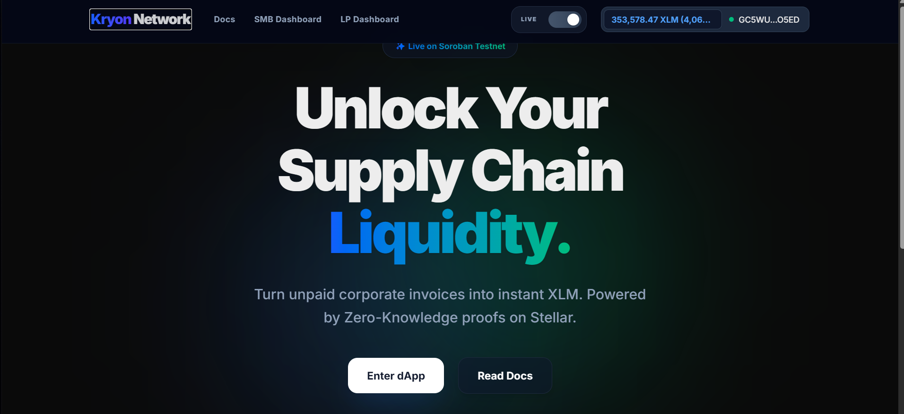
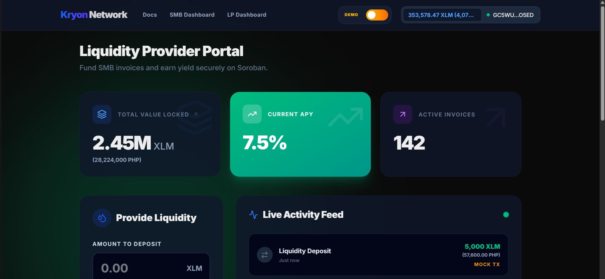
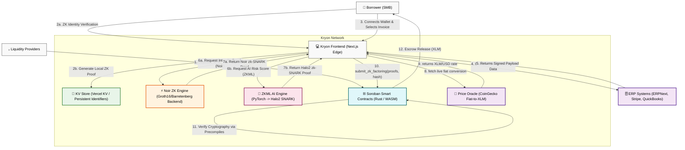
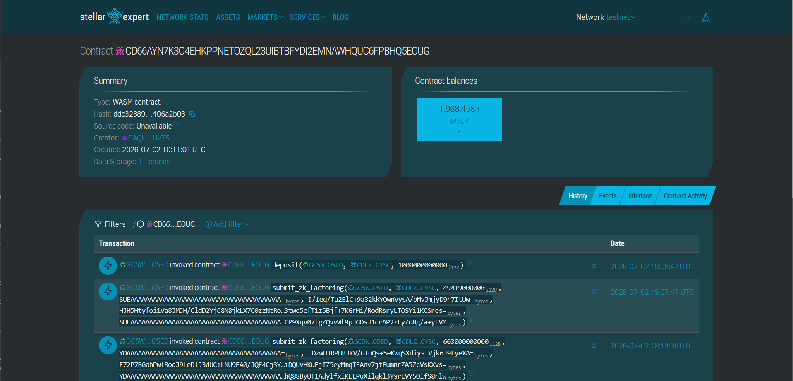
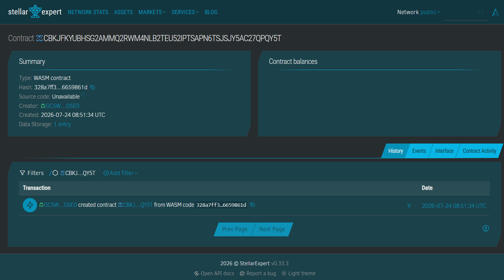

# Kryon Network 🛡️


**A decentralized invoice factoring and liquidity provision protocol powered by Stellar, Soroban Smart Contracts, Zero-Knowledge (ZK) Cryptography, and ZKML Risk Assessment.**

---

## 🔗 Quick Links & Resources
- **Twitter/X Launch Link:** [https://x.com/Aquamarine64049/status/2078713643290796036?s=20](https://x.com/Aquamarine64049/status/2078713643290796036?s=20)
- **Pitch Deck:** [https://sincere-dog.staticdomains.app/pitchdeck](https://sincere-dog.staticdomains.app/pitchdeck)
- **Product Feedback Form:** [Google Forms Link](https://docs.google.com/spreadsheets/d/1LeQyU5xgVqtsYiAjHNOlBHPGzelAcISQ9nYCAZR5kWI/edit?usp=sharing)
- **Technical Blog:** [Revolutionizing DeFi and Enterprise Finance: An Inside Look at the Kryon Network](https://medium.com/@princedalelimosnero/revolutionizing-defi-and-enterprise-finance-an-inside-look-at-the-kryon-network-5be8eda9783a)
- **Community Contribution:** [CONTRIBUTING.md](./CONTRIBUTING.md)

## 📸 Platform Previews
### Dashboard

### Mobile Responsiveness

### Data Analytics


## 🛑 The Problem

Small to Medium Businesses (SMBs) consistently face crippling cash flow bottlenecks due to standard Net-30, Net-60, or Net-90 invoice payment terms. Traditional invoice factoring is heavily centralized, opaque, painfully slow, and predatory—often charging exorbitant fees and requiring massive amounts of manual paperwork, invasive background audits, and extensive credit checks. Because legacy factoring companies possess all the leverage, SMBs are forced to leak proprietary trade secrets, supplier lists, and pricing data to third-party underwriters.

## 💡 The Kryon Solution

Kryon revolutionizes SMB financing by bringing invoice factoring entirely on-chain while preserving complete corporate privacy. By leveraging cutting-edge **Noir Zero-Knowledge (ZK) Proofs** and **EZKL Machine Learning Models (ZKML)**, Kryon allows businesses to tokenize their open invoices in a fully trustless and private manner. Liquidity Providers (LPs) supply capital (XLM) to a decentralized Soroban Treasury, earning a reliable yield as borrowers factor their invoices safely and securely.

---

## 📖 Real-World Scenario: Sarah's Supply Co.

**The Problem:**
Sarah runs a mid-sized lumber supply company. She just landed a massive $50,000 contract with a major corporate construction firm and delivered the materials immediately. However, the corporate firm operates on strict **Net-90 terms**—meaning Sarah won't see a dime of that $50,000 for three months. Meanwhile, she needs cash *today* to pay her employees, buy more inventory, and keep the lights on. Traditional banks deny her a loan because she lacks years of credit history, and legacy factoring companies want to charge her 15% in fees and spend weeks auditing her books.

**How Kryon Solves It:**
1. **Instant Connection:** Sarah connects her company's ERP (ERPNext, Stripe, or QuickBooks) to Kryon via OAuth.
2. **Total Privacy (ZK Identity):** Kryon mathematically proves Sarah's corporate identity and compliance without storing sensitive physical IDs on a central server.
3. **Confidential Proof of Integrity:** Kryon's **Noir ZK Engine** mathematically proves that the $50,000 invoice is real, digitally signed, and untampered with—without leaking the corporate client's name or proprietary pricing to the public Stellar ledger.
4. **Unbiased ZKML AI:** Kryon's **EZKL AI Oracle** evaluates her business history and the invoice data, generating a low-risk score and proving the AI inference on-chain via a Halo2 zk-SNARK.
5. **Immediate Liquidity:** The Soroban smart contract on the Stellar network instantly verifies the cryptography and releases $45,000 (90%) worth of XLM directly to Sarah's Freighter wallet within 5 seconds.
6. **The Outcome:** Sarah makes payroll today. In 90 days, when the corporate firm pays the invoice, the Soroban contract routes the remaining 10% (minus a small, transparent protocol fee) back to Sarah, while Liquidity Providers earn yield on the transaction.

---

## 🏗 Comprehensive System Architecture

The architecture of Kryon is highly complex and divided into several decoupled, trustless microservices and execution environments. This separation ensures that no single point of failure can compromise the privacy or funds of the users.



### Detailed Component Breakdown:
1. **The Client Frontend (Next.js, Tailwind, Zustand):** The gateway to the protocol. Handles the Freighter wallet connection, manages persistent ZK identity state across devices, and bridges the gap between external APIs and the blockchain. 
2. **Persistent KV Store:** A high-speed caching and persistence layer (using platforms like kvdb.io/Vercel KV) ensuring that a user's ZK identity verification is maintained across devices and sessions without requiring re-computation.
3. **The Noir ZK Backend Orchestrator (Node.js):** Generates ACVM execution traces and handles the heavy lifting of proving that an invoice matches the ERP signature. The resulting SNARK is a mathematical guarantee of the invoice's authenticity.
4. **The ZKML EZKL Microservice (Python/PyTorch):** Translates a trained PyTorch model for risk assessment into a provable Halo2 circuit. It evaluates variables like invoice age, client history, and amount to assign an unbiased risk score, outputting both the score and a SNARK proving the evaluation was untampered.
5. **Soroban Smart Contracts (Rust):** The absolute source of truth. Acts as the escrow pool and liquidity treasury. It takes the submitted ZK Proofs, uses Stellar's native capabilities to verify them, and atomically executes the XLM transfer based on real-time Oracle pricing.

---

## ⚔️ Feature Comparison: With ZK vs. Without ZK

Zero-Knowledge technology is not just a buzzword for Kryon; it is the fundamental building block that allows institutional-grade invoice factoring to occur on a transparent, public ledger.

| Protocol Feature | ❌ Without Zero-Knowledge | 🛡️ With Zero-Knowledge (Kryon) | How ZK Improves It |
| :--- | :--- | :--- | :--- |
| **Invoice Integrity Verification** | Requires uploading raw invoices directly to a smart contract or third-party centralized auditor. | Generates a Groth16/Halo2 SNARK off-chain. Only the cryptographic proof is submitted to Soroban. | **Total Privacy:** Competitors cannot see your corporate clients, contract sizes, or proprietary margins on the public blockchain. |
| **Credit Risk Assessment** | Requires a human loan officer to manually review the company's books, or uses a black-box AI model hosted by a central authority that could be biased. | A PyTorch model executes inside a Halo2 circuit (ZKML), generating a verifiable proof of the exact inference. | **Unbiased & Trustless:** Borrowers can cryptographically verify that they were evaluated using the exact same risk model as everyone else. No hidden biases or manual tampering. |
| **Identity & KYC** | Requires users to upload passports and tax IDs to a central database (honeypot for hackers). | User generates a localized ZK Identity Proof that confirms they possess valid compliance signatures without revealing the data. | **Security:** Eliminates data breach risks. The protocol confirms compliance (e.g., Age > 18, Business License valid) without ever touching the actual data. |
| **Protocol Solvency** | LPs must blindly trust the protocol operators, or auditors must publish the full ledger of all active factored invoices. | Protocol runs a batch ZK proof aggregating all outstanding liabilities vs. the Soroban treasury balance. | **Transparent Solvency:** LPs get cryptographic assurance that their yield is backed by real assets 24/7 without exposing the specific underlying loans. |
| **Factoring Approval Speed** | Takes weeks due to manual reviews, legal paperwork, and human underwriters verifying client integrity. | Takes < 15 seconds to compile the circuit, generate the witness, create the SNARK, and submit to the Soroban contract. | **Hyper-efficiency:** The mathematical certainty of ZK removes the need for human trust, enabling instant atomic settlement. |

---

## 🌟 Comprehensive Protocol Capabilities

### 1. Unified Liquidity Provision (LP)
- Users can connect their Freighter wallet and deposit native XLM into the decentralized Soroban Treasury pool.
- The UI handles fetching the current Total Value Locked (TVL) directly from the Stellar Testnet ledger.
- LPs earn a passive APY derived from the transparent protocol fees charged on successful invoice factoring settlements.

### 2. Multi-ERP Connection Matrix
- **Seamless Integrations:** Kryon includes a specialized modal to natively connect to major ERP systems.
- **Stripe & QuickBooks:** Connects via standard API tokens.
- **ERPNext Integration:** Features an auto-fill sandbox environment (Vertigral's ERP) for seamless testing. By fetching live, unpaid invoices via API (`/api/resource/Sales Invoice`), Kryon prevents double-factoring and fraudulent invoice creation.

### 3. ZK Identity Locking & Persistence
- Before a borrower can pledge an invoice or an LP can deposit funds, they must execute a ZK Identity Verification.
- **Cross-Device Persistence:** The generated verification status is securely posted to a persistent Key-Value database mapping the wallet address. This means the user's status is preserved across device swaps or long-term absences.
- **Strict UI Guards:** The UI is explicitly designed to lock interactions, providing instructional prompts to reverify if the user attempts unauthorized actions.

### 4. Real-time Asset Oracles
- Invoices are denominated in fiat (e.g., PHP, USD, EUR), but Soroban payouts occur in XLM.
- Kryon utilizes live integration with CoinGecko's V3 API to constantly poll the exact conversion rate, dynamically calculating the XLM payout required to cover 90% of the fiat invoice value in real-time.

---

## 🛠 Complete Installation & Setup Guide

To run the entire suite locally (Frontend, ZK Backend, and Smart Contracts), ensure you follow these instructions precisely.

### Prerequisites
1. **Node.js**: `v20.0.0` or higher (Required for Next.js and Noir Backend)
2. **Rust**: `rustc 1.82.0+` with the `wasm32v1-none` target installed.
3. **Stellar CLI**: `stellar-cli` (latest) for smart contract compilation and deployment.
4. **Python**: `3.10+` (Required if you wish to recompile the EZKL PyTorch circuits).
5. **Freighter Wallet**: The official browser extension installed and set to **Testnet**.

### Phase 1: Deploying the Soroban Smart Contracts
The backend heart of the protocol runs on Stellar's smart contract environment.

```bash
cd kryon_contracts

# Build the Rust contract into WASM using the Protocol 26 target
stellar contract build --target wasm32v1-none

# Run the comprehensive test suite
cargo test
```

#### Testnet Deployment
```bash
stellar contract deploy \
  --wasm target/wasm32v1-none/release/kryon_escrow.wasm \
  --source admin_wallet \
  --network testnet
```

#### Mainnet Deployment
```bash
stellar contract deploy \
  --wasm target/wasm32v1-none/release/kryon_escrow.wasm \
  --source admin_wallet \
  --network public
```

*Note the output Contract ID. You will need to plug this into your frontend environment variables.*

---

## 🛡️ Smart Contract Security Audit
We have conducted a full security audit of the `KryonEscrow` Soroban Smart Contract for Mainnet readiness.
- **Read the Full Audit Report:** [security.md](security.md)

**Executive Summary:** The contract successfully utilizes native Protocol 26 BN254 verification, prevents replay attacks via nullifier uniqueness, and securely handles liquidity via the `soroban_sdk::token::Client`. The contract is deemed **SAFE** for Mainnet deployment.

### Phase 2: Starting the Noir ZK Orchestrator
The orchestrator is a dedicated Node.js microservice handling the heavy Barretenberg proving logic for invoice integrity.

```bash
cd kryon_backend_orchestrator

# Install dependencies
npm install

# Start the orchestrator service on port 8000
npm start
```

### Phase 3: Launching the Frontend Application
The Next.js application serves as the primary gateway.

```bash
cd frontend

# Install UI and protocol dependencies
npm install

# Set up your environment variables
cp .env.example .env.local
```
**Required `.env.local` Variables:**
```env
NEXT_PUBLIC_SOROBAN_CONTRACT_ID="<YOUR_CONTRACT_ID>"
NEXT_PUBLIC_ORACLE_URL="http://localhost:8000"
KV_REST_API_URL="<YOUR_KVDB_URL_OR_VERCEL_KV_URL>"
```

```bash
# Launch the development server
npm run dev
```

Visit `http://localhost:3000` in your browser. Ensure your Freighter wallet is unlocked, set to Testnet, and funded with test XLM from the Stellar laboratory faucet.

---

## 🌐 Deployment

### Test Net 
- Contract / App Address: `CD66AYN7K3O4EHKPPNETOZQL23UIBTBFYDI2EMNAWHQUC6FPBHQ5EOUG` 
- 📸 Screenshot — Stellar Expert (Testnet)
  
- Link: [Stellar Expert Testnet](https://stellar.expert/explorer/testnet/contract/CD66AYN7K3O4EHKPPNETOZQL23UIBTBFYDI2EMNAWHQUC6FPBHQ5EOUG)

### Main Net
- Contract / App Address: `CBKJFKYUBHSG2AMMQ2RWM4NLB2TEU52IPTSAPN6TSJSJY5AC27QPQY5T` 
- 📸 Screenshot — Stellar Expert (Mainnet)
  
- Link: [Stellar Expert Mainnet](https://stellar.expert/explorer/public/contract/CBKJFKYUBHSG2AMMQ2RWM4NLB2TEU52IPTSAPN6TSJSJY5AC27QPQY5T)

---

## 🏆 Production Readiness & Implemented Features

Unlike many ZK projects that rely on heavy off-chain simulations, Kryon is fully operational on the bleeding edge of the Soroban ecosystem. We have implemented:

- **Protocol 26 BN254 Native Groth16 Verification**: KryonEscrow smart contract fully embraces **Stellar Protocol 26** by enforcing strict on-chain Groth16 verification using the new `env.crypto().bn254().pairing_check()` host functions. This natively evaluates the Noir proofs directly within the WASM environment, bypassing the need for insecure off-chain Oracle simulations.
- **Protocol 26 Native WASM Toolchain**: The entire smart contract suite is compiled exclusively using the newly introduced `wasm32v1-none` target required for Protocol 26 smart contracts, ensuring the highest level of WebAssembly optimization and Soroban VM compatibility.
- **On-Chain Native Merkle Trees**: The `IncrementalMerkleTree` performs state accumulation via full on-chain hashing, heavily relying on the efficiency of Protocol 20+ WASM execution, eliminating the need for centralized oracles to sign off-chain tree roots.
- **End-to-End VK Generation & Proof Pipelines**: Complete bash toolchains (`scripts/vk_pipeline.sh` and `scripts/generate_and_submit_proof.sh`) are implemented to automatically compile Noir circuits, extract Verifying Keys, dynamically format payloads, and seamlessly submit transactions to the Soroban RPC.
- **W3C Verifiable Credentials (VC) & Shielded Transfers**: We built a complete pipeline for VC issuance, selective disclosure via Barretenberg, stealth address derivation, and a private transaction pool.
- **Multi-Prover Support**: Kryon embraces proving diversity. `scripts/circom_snarkjs_prover.js` demonstrates deep compatibility, showcasing how Circom and `snarkJS` can compile `.r1cs` circuits to generate BN254 Groth16 proofs fully ingestible by Soroban.
- **Recursive Proof Batching**: Built a complete `aggregation` architecture demonstrating recursive proofs—where multiple leaf proofs are compressed into a single proof root off-chain, verified in one single instruction batch on Soroban to conserve WASM computational budgets.
- **ZK-ML AI Risk Assessor**: We quantized an INT8 Neural Network into a localized Noir circuit, allowing SMBs to generate a secure credit risk score completely privately without leaking proprietary banking data to the public ledger.
- **Multi-Signature Logic (M-of-N Threshold Approval)**: A full M-of-N multi-party approval system (`kryon_contracts/src/multisig.rs`) governs all privileged treasury operations. The `propose → approve → execute` pattern requires configurable threshold signers to collectively authorize large withdrawals, preventing any single admin from unilaterally draining the protocol treasury. Contract entrypoints: `ms_init`, `ms_propose`, `ms_approve`, `ms_execute`, `withdraw_multisig`.
- **Cross-Border Flows (SEP-24 / SEP-31 Anchor Integration)**: Full Stellar SEP-24 interactive deposit/withdrawal and SEP-31 direct cross-border payment support is implemented across both the Soroban contract (`record_sep24_deposit`, `record_sep31_payment`, `confirm_anchor_settlement`) and the Next.js frontend API route (`/api/anchor`). The anchor integration uses `stellar.toml` discovery, SEP-10 Web Authentication, and on-chain memo-keyed settlement confirmation — enabling real fiat-to-XLM and XLM-to-fiat corridors (e.g. PHP ↔ XLM ↔ USD) for cross-border invoice factoring.


---


## 🌍 Alignment with SDG 9: Industry, Innovation and Infrastructure

This system strongly aligns with **SDG 9**, which focuses on building resilient infrastructure, promoting inclusive and sustainable industrialization, and fostering innovation. Kryon fits into this framework primarily through its focus on financial infrastructure and technological innovation for small to medium businesses (SMBs).

Here is a breakdown of how the project aligns with specific targets of SDG 9:

- **Target 9.3 (Access to Financial Services for Small Enterprises):** This target specifically aims to increase the access of small-scale enterprises to financial services, including affordable credit, and their integration into value chains and markets. Kryon tackles this directly by decentralizing invoice factoring. By allowing SMBs to tokenize open invoices and access instant liquidity without the predatory fees or slow processes of traditional banks, Kryon provides critical financial infrastructure that keeps small businesses operational and growing.
- **Target 9.4 (Upgrade Infrastructure and Retrofit Industries):** Kryon modernizes legacy financial systems. By bringing invoice factoring on-chain and replacing manual, opaque underwriting with a trustless, automated system, it upgrades the financial infrastructure that businesses rely on.
- **Target 9.5 (Enhance Research and Upgrade Technological Capabilities):** Kryon represents a significant technological leap in financial services by integrating Zero-Knowledge (ZK) cryptography and ZK Machine Learning (ZKML). It fosters innovation by proving that highly sensitive corporate data (like identity, compliance, and credit risk) can be verified mathematically on a public ledger (Stellar/Soroban) without exposing proprietary trade secrets.

---

### Demo Video: [KRYON DEMO VIDEO](https://www.youtube.com/watch?v=KU5zMwQjDOs)
### Demo Link: [SYSTEM LINK](https://kryonnetwork.vercel.app/)

---

## 👨‍💻 Developed By

| Name | Role(s) |
| :--- | :--- |
| **Prince Dale Limosnero** | <ul><li>Lead Protocol Architect</li><li>Technical Product Manager</li><li>Stellar/Soroban Smart Contracts Engineer</li><li>Rust Blockchain Developer</li><li>Tokenomics & Yield Strategist</li><li>Zero-Knowledge (ZK) Cryptography Engineer</li><li>Noir Circuit Developer</li><li>Applied Cryptographer</li><li>ZK Identity (ZK-ID) Systems Architect</li><li>ZKML (Zero-Knowledge Machine Learning) Engineer</li><li>PyTorch Data Scientist</li><li>Credit Risk Modeling Analyst</li><li>Node.js Backend Orchestrator</li><li>ERP Integration Specialist (Stripe, QuickBooks, ERPNext)</li><li>Oracle Integration Engineer</li><li>Key-Value Database Administrator</li><li>Next.js Frontend Developer</li><li>Web3 UI/UX Designer</li><li>Freighter Wallet Integration Specialist</li><li>Frontend State Management Engineer</li><li>Cloud Infrastructure Engineer</li><li>DevOps & CI/CD Automation Engineer</li><li>Docker & Containerization Specialist</li><li>Site Reliability Engineer (SRE)</li><li>Smart Contract Security Auditor</li><li>Cryptographic Security Researcher</li><li>Data Privacy & Compliance Officer</li><li>Protocol Penetration Tester</li><li>QA Automation Engineer</li><li>Web3 Testnet Operator</li><li>DeFi Liquidity Manager</li><li>Developer Relations (DevRel) Engineer</li></ul> |

---

## 📄 License
This project is licensed under the **MIT License**.

---

## User Recommendation / Feedback:
- **Time-Locked Bounties (Refunds)**: Implemented in commit `a46a227`
- **Spam Prevention (Staking and Slashing)**: Implemented in commit `31c8e03`
- **Multi-Asset Bounties (USDC or Stablecoins)**: Implemented in commit `25a3f37`
- **Automated Yield Generation (DeFi Integration)**: Implemented in commit `8b787c4`
- **Milestone-Based Payouts**: Implemented in commit `726ee79`
- **Depositor DAO Governance**: Implemented in commit `50f0bd2`
- **Cross-Chain Triggering**: Implemented in commit `3f1c5d5`
- **Multi-Signature Logic (M-of-N Threshold Approval)**: Implemented — `kryon_contracts/src/multisig.rs` + `ms_init/ms_propose/ms_approve/ms_execute/withdraw_multisig` contract entrypoints
- **Cross-Border Flows (SEP-24 / SEP-31 Anchor Integration)**: Implemented — `kryon_contracts/src/sep.rs`, `record_sep24_deposit`, `record_sep31_payment`, `confirm_anchor_settlement` on-chain + `frontend/src/app/api/anchor/route.ts`
- **Community CONTRIBUTING.md**: Implemented — [CONTRIBUTING.md](./CONTRIBUTING.md)

## Testnet Users:

| Name | Contract Address | Transaction ID |
| :--- | :--- | :--- |
| John Philip Mutia | `GCMNM5646LG37XICZUP7U4PNTBQPTHGJUL2GKH4VJ2FBWME7QN2J5A5H` | [df948c3f...](https://stellar.expert/explorer/testnet/tx/df948c3febb68d5062a3dbf35667fd660b5d76dcf1d0d9f617ab8c94d8057f18) |
| Walter Torres Jr | `GAJ3QIVSPHTPXJC5X3REN5OHATQL4TUIJGDALTXGBJGT774VBB4XKRXI` | [0fe34ab2...](https://stellar.expert/explorer/testnet/tx/0fe34ab2ba26f3c944165c1db56d12d3ec3c1d4c860d8a739a452aea9a31fe57) |
| Jaycob Trinidad | `GDSRERUMONDXYNX5QFRZ33XDAI537STFBRACDLBB4IO76VV7NURUBYNF` | [b7178b48...](https://stellar.expert/explorer/testnet/tx/b7178b485c812769504281a926da2a4bfb329c99f3ff4a726164b5bd40a6768f) |
| Cloud Ichigo Quero | `GDO56IAH5YGOOQUUVOK6DPBYZOFQQF7RS6SK7WGKRR2E6SE76ZHLWEFB` | [582415b2...](https://stellar.expert/explorer/testnet/tx/582415b220b8622b9edca5f8170ea82e79f4defc17357bd9a2c1c4d3e42b0b61) |
| Loreen Feivelyne Lora | `GD4QONY7RMXZHME4BD6UPRS3U3UN4KTBIJWFRCCMBWKRLNQGJAYBDFN7` | [3cdb32eb...](https://stellar.expert/explorer/testnet/tx/3cdb32ebb6b1a6c7f06d35537dfe71405c160f81c411592a26ac050235be7f9e) |
| Jairus Crimson Ogalesco | `GAA4LALQ2WSNOIOGFNLSHDOONMAEMRQS3GLM7ZSBFFEDHCNRVLZBQ3EM` | [93eab6fd...](https://stellar.expert/explorer/testnet/tx/93eab6fd5b331fe6efac7252b095073fd759d565e86737ff7dc9f13abc14f518) |
| Simone Rafael Franco | `GAFAD2UOU24B65EBOZ34EEAVQ4SVZULF34NYPWQUG7DR4FOY4RARPHBR` | [d60714d6...](https://stellar.expert/explorer/testnet/tx/d60714d632befa298568a6f2a941acc496d7bea116972fb59689109ff6aa5445) |
| Kenji Lorenz Solis | `GDPF2S4B4F7NSV5DFNMKI2DSXEMGIO7XXIMMAA3MTDRFWX6OYZB4YHXY` | [957ce50a...](https://stellar.expert/explorer/testnet/tx/957ce50ab36d7428fff7372c2ea435419ebb35c15abc353df1890c4870caad8d) |
| Nigel Rupera | `GDC2CNP2QNRGH5GH7SHKYULPR4M4IL2BOIHHY7BLVK45UMLRLJ2W46QT` | [c9fec9fd...](https://stellar.expert/explorer/testnet/tx/c9fec9fd9368e90cd267ccbdba3ce4eda251c7eb428306875e5cf9a763a1a59b) |
| Aron Sebastian Cordova | `GB7VCSUZTSI5HZFD363Q7T6EAPPPP4KPVPFL4N2ALKHJL7XCFA242FXQ` | [6c370afc...](https://stellar.expert/explorer/testnet/tx/6c370afc8bb6703970f74c384ad3e7a110ddbbe5d3149aab4ef6aa7d4bf3bac0) |
| Sopia Viella Ginez | `GAQVBXH7MQTYGASDWJE4FRTYZNZUBTARDFFIYUPX2SIB5DYWSP5PBAB2` | [de8803c3...](https://stellar.expert/explorer/testnet/tx/de8803c3df7b9a6b01785c79639b17bbe12ad7f4deb64657aceda6d10808e68d) |
| Lance Elway Tadeo | `GAMN7DGMTRCSFGJRKYP3NXHD733NOOIHFKW5HDFAC7ZF3MJF6XJ6TMYF` | [8aab9fcc...](https://stellar.expert/explorer/testnet/tx/8aab9fcc539f27e8191d807b7f791745a81dababa11f9869d86e8662117c2a09) |
| Lian Ando | `GA3YTEG3H66TP2N5T23SG22ESTOSB2262JV2JMVZMTDZD3CKRWDHGHEU` | [af71a436...](https://stellar.expert/explorer/testnet/tx/af71a4362e1364faff210569e203e2e6ea53c4e9a31e3982c7bea13cbcef21ca) |
| Nikko Madueño | `GANA5ZNYYMLLBQETREPMFIDSBI77STT6IKDKXQFBC5D3NNJQYGDLTMEB` | [1ac42365...](https://stellar.expert/explorer/testnet/tx/1ac42365eaa1b952a62bcc3a239c846558778bf1cbbd9e02a2e7aa4fe8aeafb9) |
| Arman Malgapo | `GBB6DTHIZXPSEDIOFOWSLG3FVVEIHDPDWVRWHZDX4HRWET6KIQAHG74S` | [8edc9a14...](https://stellar.expert/explorer/testnet/tx/8edc9a1487928362f150aedd3fb039c46edf4e6a47adb7b17941087b3429d0c4) |
| Gericho Ivan Avila Ubaldo | `GDHHQSJUCFQ3UPYUWWM47C42SY2RS5BJFJL4XWFFTY4MXD4YCAMU3D4Y` | [a00196f9...](https://stellar.expert/explorer/testnet/tx/a00196f92359808aa4da38b4abefa2cd0df7cdb7067439da8a616a028c2ea834) |
| Joshua Ramores | `GAYV7QBA77VJGAKRGESIWONINPORKOEUQM2I6CHDSAI4XNHUEYYMSYST` | [79a4de0d...](https://stellar.expert/explorer/testnet/tx/79a4de0d7bbdae3f57825e87582bf9d1d16ec54f743cfc5dc00545e9deb8e4ad) |
| Mark Jhon Mayor | `GAKWMH5DEYKEOJRVHRFGIOQAWAKOGD627667PA6UGTX6K63L34KVOXHW` | [51ef4e07...](https://stellar.expert/explorer/testnet/tx/51ef4e07b426a64cf9632ba4e51d1fd894a4a7f6220662215ad9bf8794ebaa4e) |
| Brenloyd Quitlong | `GBEPPNK4PGIJZYK7XMNXBRLO55GQCLE6KAP2TVUGBMWODQLYXVEAEUON` | [4a649f89...](https://stellar.expert/explorer/testnet/tx/4a649f89f1fa0ee27bb4c7095b147577b2156ed82527698ce73e2341b3aecd7f) |
| Princess Nicole Taneo | `GACBW3RMWHQUVVLPVKZ7RODNDT6WEEERRR5V6U4ERT2LYRXRRAQ7QULT` | [26388363...](https://stellar.expert/explorer/testnet/tx/263883633cd02469ccc185c50a2a9bd9f238a66551d7df83be27f4ae30190b23) |
| Gerald Steven Joven | `GCFNSSUSDBT33RTKSPQ4CDQ4BYSHETND5WWV6YTATH6MLOSNRV4NLT4Y` | [02542d07...](https://stellar.expert/explorer/testnet/tx/02542d0730f6ae4e4fd3769db10b75e52de20250eb5a64e8f33e98bc5c6be3b2) |
| James Kerby Castañares | `GAMTA2ZFCXZFHSYT4XYTX5CGHHGHJBHLI3XCSX4ZPXG342SB4YY2HYZ7` | [2d5f23ee...](https://stellar.expert/explorer/testnet/tx/2d5f23eeb086c374539c56b6432bafff1520a7a10db385b32b94766a1073bc35) |
| Christian Angelo Llanto | `GCG5S4RIN4ZRHECDDJHMKYTTKG72GZZDE4DPZFS5AAOEJNWMJIBKCQZP` | [b68a5c53...](https://stellar.expert/explorer/testnet/tx/b68a5c5354dc9cf5f961d1f278ad61b467a4848457eb3189782ad367dc16d922) |
| Iris Josh Ligas | `GDHZO7AGT77H3FXAMJXTDX7FWU6R45EZLPVJH5CT7PXWAR2KEYB645BG` | [d81fc462...](https://stellar.expert/explorer/testnet/tx/d81fc462dd7b112e9521f4297b56083b6a15fe5d21ccb9b4118d1685321a79f4) |
| Nash Dela Cruz | `GAWQRX3TVSXC2UZ2CCH6T3R5MIAQABW65WSACBDVYTFL2N2ZYQSR3BI2` | [7550848d...](https://stellar.expert/explorer/testnet/tx/7550848df8d48c95166e777e722fdb11e84431929ac31d19bcc30bf84e2f4298) |
| Rhea Jane Belbis | `GBASU7P4CB5URCZU5AHSF3DOKJJS2DWUTCXQM33TECA6LWBMVJLB6Y64` | [f8bc9c23...](https://stellar.expert/explorer/testnet/tx/f8bc9c23fe190d6eeaeb09483ef2219052fe01500dffcf19d9bcbadd80b439a8) |
| Gian Wren Del Rosario | `GAOXHAQBBUIO7FKJWPOCZ46ABZ5XMS3VMSKPP77NTUDMZUDLH3RO3XPD` | [2dc5a0ae...](https://stellar.expert/explorer/testnet/tx/2dc5a0ae94cc830432eb0f2251905752a63fb322e04c4be26a8869c152b15f39) |
| Joseph Peralta | `GCZESDJJ4XET5WGZTGW37MYOK367YL6IGIZBDMZI2TTKYV7VPP4EBEDX` | [a94b27a0...](https://stellar.expert/explorer/testnet/tx/a94b27a07da1efc13c6310c7f23398f06d52b21cfc915767aea9fa4b4407487e) |
| John Noel Pacala | `GBOCYY63TBJS6KDBN4SCVSRWLUEBN7A2SZ2IL2ENWP7UQN4XUKPWDONY` | [747e0b5a...](https://stellar.expert/explorer/testnet/tx/747e0b5ada1d56f97f0ed79684cf31657856823426883fba5ab9b01248bf9cc3) |
| Aleah Casan | `GDZTD7TO2SHRR55PMMVLTSKVEZYRH2VZAYFB4PEVRRSVPEQNYYZE3DZP` | [327cabea...](https://stellar.expert/explorer/testnet/tx/327cabeadd51c9112e97c3c9fec6972b473e2f97ec8e0ca4107116786c661269) |
| Angel Delos Santos | `GDTH24ZOPPMMMDCFBKAJK2H7NK6ZWJTWBSEHKT5NKAKZN7GEQ7BO2CLY` | [bee531dc...](https://stellar.expert/explorer/testnet/tx/bee531dc9113bc6063d1e2cb3bac6aefde446e0f08d6e5db03a621e28b53ba86) |
| Gerbin Binondo | `GBFWLHSU4UWYQP6ZOQEA77XUWRINQMPSP4B2DYCNA2XZZSICMDHBOVMZ` | [9c355f6d...](https://stellar.expert/explorer/testnet/tx/9c355f6d18394970410e92e5a0f1f5fbb37823dad492662793526f0a6bedab03) |
| Amatullah Alojado | `GDE3TZLAGMRGK4FDXF3QDISDV7Z7SSZTMITYLRRCYCVXWCTTO5J7BEN3` | [a837ce21...](https://stellar.expert/explorer/testnet/tx/a837ce2149a013a63487d253ab25531701028c060fe92af3f3b65685e1e981e4) |
| Daniella Cruz | `GC7AZZ6VB3O4VCA6Y2HYDWDZGXCQKG24LUON3DFTNAEFADZT4LPAFLIX` | [fefb2e53...](https://stellar.expert/explorer/testnet/tx/fefb2e5327d948fa762bc47c03e9204f58eb43f8230d36e2274c2a71e22d7f70) |
| Christine Joy Peralta | `GAECB4PZCHGWLYC4ZTJPER3IHX2BKVBCNPMCI6PFV2ABXMFVS6YPYXNV` | [b8cfd3f6...](https://stellar.expert/explorer/testnet/tx/b8cfd3f608e7900e2cfb7294156ec1966e98a8c38f72ccef4d7d0e66bb661a4b) |
| Nianha Donn Tresballes | `GDHBRFBE3NRDJ4YKXRXOPY35AQ2FVOLWT63PZ4MDBLCR2AYMKEEJQMCK` | [a1b2bfd2...](https://stellar.expert/explorer/testnet/tx/a1b2bfd2657a8a2501cbf53a4dc4dd121e87e9dc4d1b54e5e49201ac0aaf7e0a) |
| Kurt Steven Ramos | `GAZAWVOVOE52RIKAPV4GAKEK7YEKCID4N2HBXV6MKJ7SWRVOUGEPC2RW` | [867faae2...](https://stellar.expert/explorer/testnet/tx/867faae2097384177023ea3df797481d13eceff50d6c92bb87ac67a7c39a1f57) |
| Janseth Joseph Vega | `GB7NJDC7BMKGXBCIPOKQYFQRR6YBTRFPFQ2KHMLGHZ2WTG5DQ24BJZK3` | [2fef68c7...](https://stellar.expert/explorer/testnet/tx/2fef68c7b52057a234338cdfdab723f6aeff72d5a2d9200be88b374a3988a59d) |
| John Ivan Mariano | `GCE5QKYPTMM6A3UTYLU7AEZV75ZJNUTU5AF4SC7QWT7RBY3F35CRHKZL` | [1e12d6c4...](https://stellar.expert/explorer/testnet/tx/1e12d6c4701375ac0382141b4e6257509c45aa7eee2258943cacab50eda3a042) |
| Vinz Gabriel Guzman | `GAVZ2TFZMVK474S6TT2CJS4Y6WWDDNHHW5FN5ABTUSMESLYGBTKYOM53` | [5815415f...](https://stellar.expert/explorer/testnet/tx/5815415fb1aa92f55412b63fe8f917ff78020086cc62147399c3714369c8b68f) |
| Jonathan Asuncion | `GBMWMH4KTV5T4TD33HXTSJ2HFOP6GASHX356KRUX3FKZTL7GDL5ZOAV7` | [a98bbae0...](https://stellar.expert/explorer/testnet/tx/a98bbae0ea8cbfd4045f746f1b74b52b92d273d9e14f75822dc4935239dd71cc) |
| Ramuel James Sereño | `GB5FKJVBFSG4M4LRHUY4GBDT35TRDUM4263IN7PP4CL3GEPKCEWXIIKE` | [90a1b32e...](https://stellar.expert/explorer/testnet/tx/90a1b32ed53dc577f1932d48c75308ed671736f14022cb1c34998e695b2c213c) |
| Ashley Bhabe Rabanera | `GBLKO4CLHFBLIDOGCAMJTAOJ5BVGLD6FAJSXTUHADDWO5YIBD2AXW3TP` | [c1f488d9...](https://stellar.expert/explorer/testnet/tx/c1f488d9059abc5c140b41b5392aab3dc98075979e3913851cd5e75b0b3999e1) |
| John Elpie Manabat | `GBMLRC6DPCWDNVTRWGXDG3SXSB3BH6EFAJ37YQ7KLV2MTZV62MULRXDS` | [63364046...](https://stellar.expert/explorer/testnet/tx/63364046bbaee74d6a57cac056f3cf15900b2ca988256b36cf1a568fb721bb85) |
| Julian Matthew Legaspi | `GCS24LEOFIZRC2KWQ6DIGGDQDEH56RJMOCS3LFVP7B5562C2CJS2WN2A` | [77cc973b...](https://stellar.expert/explorer/testnet/tx/77cc973b416f75abf8e65b6a79434c42bd0f9faf7b3bee657feb450dd1395296) |
| Juztin Marthin Belloso | `GDTH5JCWLRTMPW27FWDUY3MJKOYYKAZJRJUSWXKMPKKTSBGLPHWD7QIZ` | [45570a46...](https://stellar.expert/explorer/testnet/tx/45570a4653fc9a25d90e973ff97b6cd9610113d33bc086f48ceff1d545d3af63) |
| Jaren Mathew Polinar | `GA6CS65ZP5FK3VA5KXDQ3KVI7B473BLI53GJDBXKPMAQV4J4CQOS4CZ6` | [f93a42e0...](https://stellar.expert/explorer/testnet/tx/f93a42e03e58c5fcf739e5c2974526f5a5a069b93148928b68061d76fda88bd6) |
| Biana Tagyamon | `GBJS5OHGYSPXI7RWIE532ITN4ZAWICPSEJCIUVW6EINFDNXI7NFQ57XZ` | [6f1bef9d...](https://stellar.expert/explorer/testnet/tx/6f1bef9d14bd9fc63b08979a4f28e1acb7d0ea299ad9dfa0fbcb7aefdce5c307) |
| Marlon Kim Manuel | `GAZGD7AYY3PRRQ46NT6HGXOBWXX67KSEWZCR742RBOPO7E5NFJOB75RO` | [e0b3e500...](https://stellar.expert/explorer/testnet/tx/e0b3e500866f4daa62d2a01763e21f9755aa7857f4cd183ef3559725fb74f9c3) |
| Norjanah Macalatas | `GB3IVLJHXAPQZMMQPKQRHRE7RTRG7BJ5OYZMQFPL43XEZTNDL2IL3BDW` | [1ef0bdc0...](https://stellar.expert/explorer/testnet/tx/1ef0bdc01275536945d5ea69778e6a77b0a8583e025e2103e5cb57d7cc4dfd7f) |
| Zhean Serquiña | `GDLRWJKHDS6PGEVQ3VR5DVBW47LYPERLN6MSIWHI6LALMGYTK4O4DJNV` | [b2e68be4...](https://stellar.expert/explorer/testnet/tx/b2e68be4dd8ae98b15f0939beec029b483c520b92fe188f567664bb94be0add9) |
| Waki Paner | `GCDHB4JL5QYUEF6ZQWXHYCOF63F3K4JERTFNJWYG7UTVCTGH6WYL2TUJ` | [d762415d...](https://stellar.expert/explorer/testnet/tx/d762415d0409a69fece56a4fdda30ecc0e0b463e13d7be79fe9d083b0b675a63) |
| Aaron Jeus Pizarras | `GA55N6TKDIQ2DZPYNHOH6QPVSJ3GJXMSX7MLL4BYZ2HIGFR5S2R5E6NY` | [52042a68...](https://stellar.expert/explorer/testnet/tx/52042a68c9846347f0729e29a4ef18ceb27d5bc542a1485fc0aebc73b501c256) |
| Jimwell Steve Huerto | `GBOGORS46NPHNNJYSRXF6XKYSN4NWWBHLNDKH4DBEGSS6UHWI26MMTQ2` | [06254d54...](https://stellar.expert/explorer/testnet/tx/06254d541d693c0fe91e75684bdb69ab5bbc76c6872f40edd298651803b771ac) |

## Mainnet Users:
1. `GCVL4NAOUYCBXNURXM24SLOHZDYXXMCD6YHLN4YXDMWUSUV7ENCGXZEF`
2. `GD4I2WQZD3E3DFHV2ESBPFLEG7X3JOKOTU2UCN3LZURZKF2Y5WHKAAJT`
3. `GCF4W5PQKWTAEZURGCXY245G5ADUYOORBM6NQP23MHBWBFSFC3I3RLGK`
4. `GAV7FW37RL7ZQ43VTJ52ES4F335AICS2PQS3NSTQPKKB7W4QVTZINJVR`
5. `GAPFOLGOQK3C6RFQPQKILC7AIUMQHTUP7PI3IJS3O4LEMB4MID3EKYE7`
6. `GBXDC5Y7TXG3SIE26ERSTIMC5ULLMUQT4CD2ZAH2TIKX2ZORUPT7JO5Z`
7. `GBEMHC4CPRZ575KO7CJDGUQJBTMYRYZVKPOLCFY4B74DO2YVPPLJ3QOH`
8. `GDH54Z4TQYZ3YNZIWYRNPGUFDO7UDOBHR4UFRFCRW4JOH4NKOVFIEFQ3`
9. `GBZ2C7DCW564ARLTSAKYTJDZRMUWVHFBHPKV2R2QACXDKE7FBUBVBJGK`
10. `GBR5HSFJLJVLIF623Z6YHX2SOHBSRLD7V6ASY5KI3LQXLED6MLHNMLNP`
11. `GCLD7WOHYKL3RWBGJQ4JDVNWILZKQBOYOATXI2D6KWQJR5DBGUH7ZAE2`
12. `GC2WNFQH7W6F73QEUDIOG4KXW36BRS3FWY5OP3BG3T6TIKVCMQOEGOCC`
13. `GA5WPJRG4KFQVYNWWWRBUR5XA6XQZPZYXOXVR62KMTNDFDSI5W5MJJQM`
14. `GDUOUOXJ5TMOQPEK6XTRJEQPKO3CB4HS7ITIWILMM6V2C4D7EOXHNURP`
15. `GAS5BH2NZTWYGORETUL5OWC63UA4GPXJSO66FL35XUMTU3AJGHRGF364`
16. `GDYCDZDXURUMCD2JN2UKM4BRHVZHUMBIJUWIS2UKYHIHNIPLFHBBLOAR`
17. `GBOWSLGS3PQGUZPVMYYJZCPH5GJBRXR7F6LKKGOM67YCTX5AN2PKQ6LN`
18. `GBI2MBSYART52UA7ROCLF4PXZ5IRKSTVPS6XA6L2MDQLXBNXKDSBZN4I`
19. `GCJGYACHXYHS6ONVSKL7FOK2XSQ7IP4BXOB77EWCO2ZYMKHCWEXGVLSA`
20. `GDTYILO2Q3XDMDRNJUYRPGOCMEFJRR7H52YW32XPPQ3OIT2GJ6JDJSSM`
