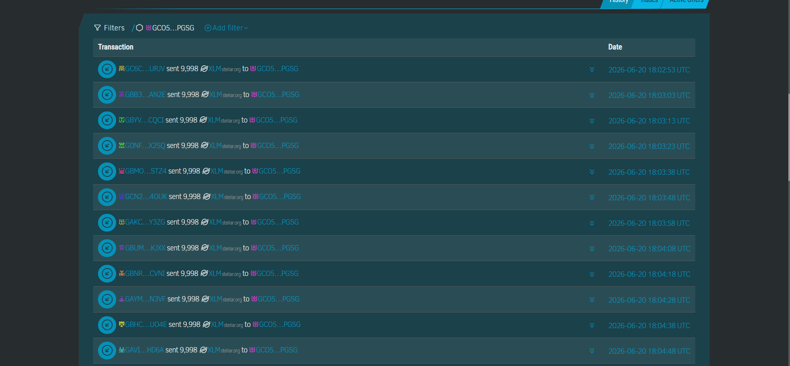

# Kryon Network

**A decentralized invoice factoring and liquidity provision protocol powered by Stellar and Soroban Smart Contracts.**

---

## 🛑 The Problem
Small to Medium Businesses (SMBs) consistently face crippling cash flow bottlenecks due to standard Net-30, Net-60, or Net-90 invoice payment terms. Traditional invoice factoring is heavily centralized, opaque, painfully slow, and predatory—often charging exorbitant fees and requiring massive amounts of manual paperwork and credit checks.

## 💡 The Solution
Kryon Network revolutionizes SMB financing by bringing invoice factoring on-chain. By leveraging Zero-Knowledge (ZK) proofs to cryptographically verify live ERP data (such as QuickBooks or Stripe), Kryon Network allows businesses to tokenize their open invoices. 

Once verified, Soroban smart contracts instantly route working capital from decentralized Liquidity Provider (LP) pools directly into the borrower's wallet. When the invoice is paid by the original client, the smart contract automatically settles the debt and distributes the yield to the LPs.

---

## 🎯 Vision and Purpose
Our mission is to democratize access to instant working capital for businesses worldwide. By removing the traditional banking middlemen and utilizing the lightning-fast, low-fee architecture of the Stellar network, Kryon Network aims to establish a global, borderless factoring ecosystem that is transparent, highly liquid, and universally accessible.

---

## ⚙️ Stellar Features Used
- **Soroban Smart Contracts**: Core logic for escrow, risk assessment, and automated yield distribution.
- **Horizon Testnet**: For rapid prototyping, transaction submission, and testnet ledger verification.
- **Stellar SDK**: Programmatic transaction building, XDR serialization, and native asset (`XLM`) routing.
- **Freighter Wallet**: Seamless, non-custodial user authentication and transaction signing.

---

## 📅 Timeline
- **Phase 1 (MVP)**: React Frontend built, Freighter wallet integration, mock ZK-proof flow, and basic smart contract scaffolds.
- **Phase 2 (Testnet Launch)**: Full deployment of Soroban contracts to the Stellar Testnet, live ERP API integrations, and audited LP pools.
- **Phase 3 (Mainnet Launch)**: Production deployment on Stellar Mainnet, integrating USDC for stablecoin factoring, and full DAO governance roll-out.

---

## 🔗 Live Testnet Deployment
- **Deployed Contract ID**: `CCJUOYAZCR4JHADRXSV7IOAHPX45SW3IXH6FJ4A4FM22ARIWDNTJYNNP`
- **Contract Deployment Hash**: `0be5a3e8e87bb51a2cc8ca619ec98b0cea6bb01f9b37751fb1f662ee04a67383` (Verifiable on Stellar Expert)

---

## 🛠 Prerequisites
To build, test, and deploy the smart contracts locally, ensure you have the following installed:
* **Rust**: `rustc 1.70.0` or higher
* **Target**: `wasm32-unknown-unknown`
* **Soroban CLI**: `stellar-cli` (v21.0.0 or later)

Install the WASM target if you haven't already:
```bash
rustup target add wasm32-unknown-unknown
```

---

## 🏗 How to Build
To compile the Soroban smart contracts into WebAssembly (WASM):
```bash
soroban contract build
```
This will output the `.wasm` binaries into your `target/wasm32-unknown-unknown/release/` directory.

---

## 🧪 How to Test
Run the native Rust test suite to verify contract logic, mathematical precision, and edge cases:
```bash
cargo test
```

---

## 🚀 How to Deploy (Testnet)
Deploy the compiled WASM contract to the Stellar Testnet using the Soroban CLI. Ensure you have a funded testnet identity configured first.

```bash
soroban contract deploy \
  --wasm target/wasm32-unknown-unknown/release/pledgeelock_contract.wasm \
  --source <YOUR_TESTNET_IDENTITY> \
  --network testnet
```

---

## 💻 Sample CLI Invocation
Once deployed, you can interact with the live smart contract directly from your terminal. Here is a dummy invocation for submitting an invoice factoring request:

```bash
soroban contract invoke \
  --id <YOUR_CONTRACT_ID> \
  --source <YOUR_TESTNET_IDENTITY> \
  --network testnet \
  -- \
  submit_factoring_request \
  --invoice_hash "e3b0c44298fc1c149afbf4c8996fb92427ae41e4649b934ca495991b7852b855" \
  --face_value 150000 \
  --borrower <BORROWER_PUBLIC_KEY>
```

---

## 📸 Screenshots




---

## 📄 License
This project is licensed under the **MIT License**. See the [LICENSE](LICENSE) file for more details.

